# 502 Project web graph analysis.
### Team Excelsior: Ziyang Zhang, Feiyang Jiang, Xuejun Zhang

  

*Picture from https://www.youtube.com/watch?v=JsEm-CDj4qM*

## Executive Summary

In this project, our team expected to explore the intrinsic website network structures based on the Common Crawl dataset which consists of monthly web crawler log files. Due to the time constraints of processing this much data, the team decided to study 512 random sampled files (~ 200 GB) out of 56000 files. The key features the team studied are the Indegree/Outdegree, density, the number of edges and vertices, number of connected components and community size by LPA algorithms. 

In order to mirror the actual traits of the entire dataset, the team divided the dataset to different sizes (2, 4, 8, 16… 512), and then regressed the feature measures onto the sizes to explore the relationships between sizes of the data and the change of the feature measures. The result shows that many of these features have quasilinear relationships with the sizes of the data, which indicates to some extent the information overlap among these data files. Some features don’t scale in a linear manner when data size increases, while others, like outdegree, have no pattern at all.

## INTRODUCTION

In network science, a graph is composed of nodes (or vertices) and edges connecting these nodes. In a directed graph, edges are directed lines. The webgraph is a directed graph, whose vertices correspond to the pages of the World Wide Web (WWW), and a directed edge connects page X to page Y if there exists a hyperlink on page X, referring to page Y.

Website networks have become an insightful topic in data science. The property and topology of the webgraph is an interesting field of study, which has already brought many applications in real life, like page rank, community detection, cyber security. This big data project is aimed at analyzing some properties of sampled webgraphs and trying to figure out whether the results on these sampled graphs are scalable to the whole web graph. This will be achieved through studying the properties of sampled graphs with different sizes. The relationship between the sizes and the studied graph properties will ensure some confidence about the scalability of the result.

## CODE FILES
* tld_mapper.py : Mapper used in hadoop streaming for data processing.
* sample_wat.py : Script used to randomly sample data files and execute the hadoop streaming command.
* 502_tlds.sh: The hadoop streaming command.
* wat.paths : All file paths used for sampling.
* web_graph.ipynb:  Jupyter notebook for analysis.
* instance-metadata.json

## METHOD
### Data Cleaning

  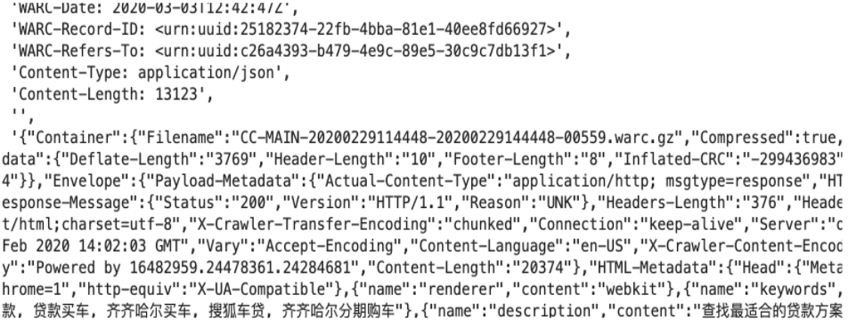

The original dataset on [Common Crawl] (https://commoncrawl.org/the-data/get-started/)  has web crawler log files from 2008 to 2020 for each month in different S3 destinations. The team chooses the crawler log files in 2020 February for this project. There are 56,000 log files in this month and in total compressed size of over 50 terabytes. In order to study the general pattern of the network pattern in these log files, the team randomly sampled 512 log files from 56,000 files. Because log files are in WAT, WARC and WET format for the same content, a mapper is used to extract the website domain links from the WAT format log files. WAT format files are shown in the above figure.

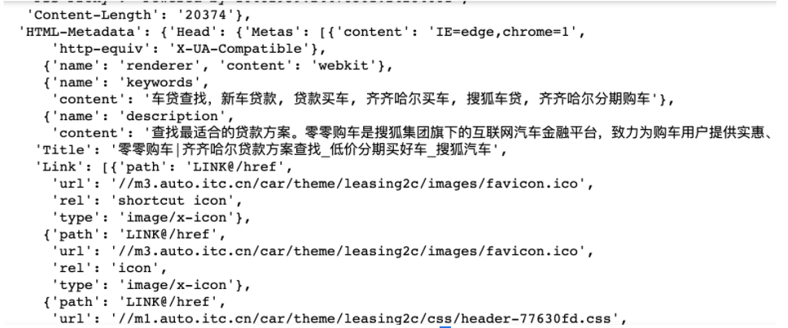

This mapper first transforms each WAT file to JSON format as shown in the above figure and then extracts the sets of domain links in pattern “A B” as shown in the figure below. “A B” means there is a link from website A to website B. Links between similar domains are deleted, such as “123.sohu.com  456.sohu.com”.

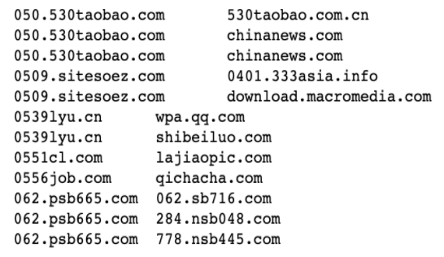

 This project only considers top level domains, for example, all facebook pages are represented by one node “Facebook”. 

### Tools

Hadoop streaming is used to fetch the files from Common Crawl S3 and perform a map operation to clean the files on Amazon EMR. Cleaned files are stored in the team's Amazon S3 bucket. Graphframe package is applied for webgraph analysis in the Pyspark environment. 

### Models and Technique

As mentioned above, the original dataset are WAT files. To build graphs, linkages between web pages are first extracted and each row of the cleaned dataset is in the form of “source destination”. The cleaned dataset is then read into a spark dataframe and the vertices are the distinct values of the flattened edge dataframe. Next, the webgraph is built using the Graphframe package. Finally, graph properties like number of edges, vertices, densities, number of connected components and number of detected communities by applying the Label propagation algorithm (LPA) are examined using the Graphframe packages.

### Hypothesis

Before the webgraph analysis, the team has a reasonable assumption that all the data files are independent with each other, which means that they have no overlap information between the top level domain of the websites. Based on this assumption, the following hypotheses are proposed. Number of edges, vertices will increase linearly as the sample size increases. Indegree, outdegree and communities will increase as sample sizes increase. The distribution of the community sizes resulting from the LPA algorithms will not change when more samples of data files are included. Number of connected components/strongly connected components stays the same with an increasing size of data pools. 

## Results

### Vertices and Edges

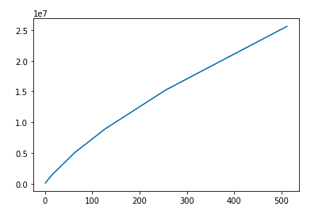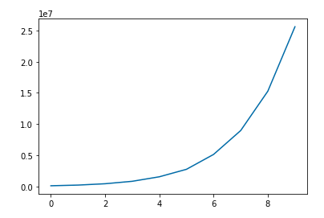
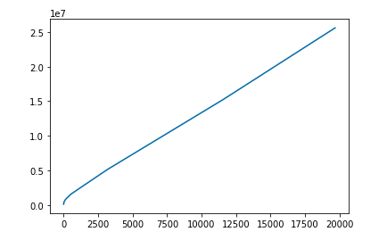

*Number of edges to sample size, no scale(left), log scale(middle), log^4.5(right)*

The graph on the left is the number of edges of the web graph versus the number of sampled files. This line is not exactly linear and the slope of this curve is slowly decreasing. This result does not exactly match with the initial hypothesis of linearity. The x axis of the one in the middle is log-scaled and that of the one on the right is log-scaled raised to the power of 4.5. The line on the right has a R2 score of 0.9985, which is very close to a linear line. Similar results can be obtained from the analysis on the vertices:

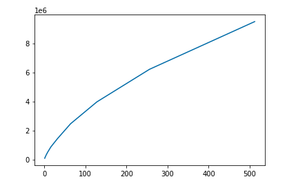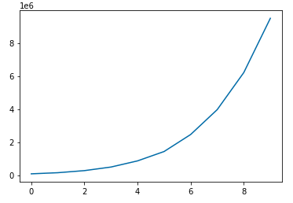
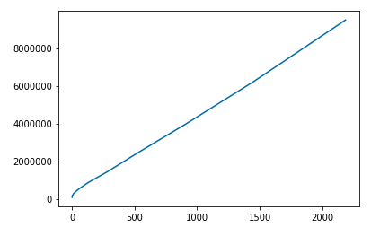

*Number of vertices to sample size, no scale(left), log scale(middle), log^3.5(right)*

This analysis shows that the assumption that all data files are independent are not exactly the real case. Small part of the content in each data file is repeated in other data files as well. Thus, the properties of the graph constructed with sampled files cannot be scaled in a linear relationship with the number of files. The fitted line on the right indicate that the number of edges as a function of the sample size is: 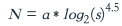. The derivative of this function is negative, which means its increasing rate is getting smaller if this pattern still holds as the size increases to near 56000.

 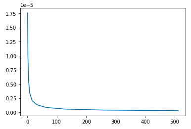

Density of a graph is the ratio of the number of edges to the maximum number edges. Both the number of vertices and the edges increases quasilinearly, thus the density will decrease as the size increases.

### Distribution of the community sizes resulting from the LPA

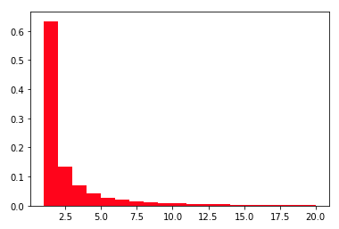
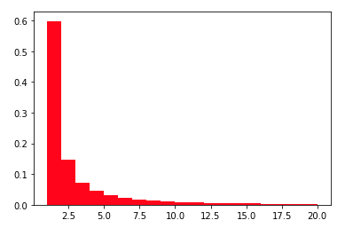

The histogram on the left is the distribution of the community size from LPA using 1 data file. The histogram on the right uses 16 data files. The distribution is generally the same, but the proportion of communities with size 1 is decreasing. Because only 16 out of 56000 files are used to run the LPA algorithm, this result is not scalable when more data files are included.

### Number of components / strongly connected components

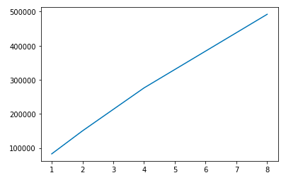
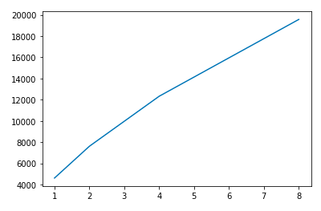

Surprisingly, the number of connected components and strongly connected components exhibit a highly similar relationship with increasing data pools while the strongly connected components increases approximately 2 times faster than the number of connected components. This finding contradicts our hypothesis that the number of components stays the same with increasing size; however, this finding validates our assumption about files which are drawn independently from the network that there is barely overlap between files. 

### Indegree

 Indegree is the number of edges entering the nodes in directed graphs. Interpretively, in the team’s web graph analysis, indegree measures the number of websites leads to the specified websites (vertices).

  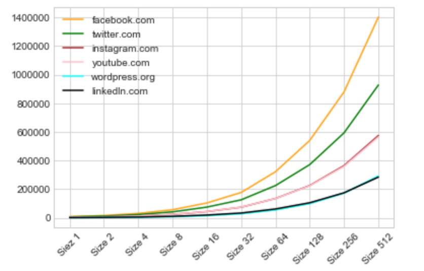

As shown in the figure, it is found that as the sampled log file size increases exponentially, the indegrees of the websites increases exponentially as well and this aligned with the team’s hypothesis. Social media websites such as facebook, Twitter, Instagram, Youtube have the highest indegree which means lots of other websites lead to social media websites. Because social media websites mainly make money via advertisement ("How Facebook, Twitter, Social Media Make Money From You", 2020), the social media websites have highest indegree implies lots of websites embedded advertisement links on social media platforms. One surprising find is that wordpress.org which is a software website also has very high indegrees. 

### Outdegree

Outdegree is the number of edges leaving the nodes in directed graphs. Interpretively, in the team’s web graph analysis, indegree measures the number of websites the specified websites (vertices) lead to. 

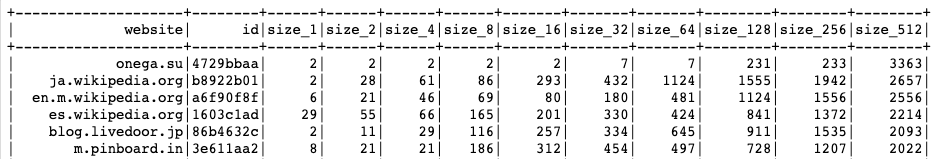

As shown in the table, as the sample size increases, the outdegree of websites still increases in general, but with no specific trend. However, for the link ‘onega.su’, its outdegree doesn’t increase as the sample size increases from 1 to 16, so this suggests the outdegrees of websites probably don't have a very strong relationship with sampled file sizes. Actually, as long as a website doesn’t appear in many data files, its outdegree will not increase if those data files are included. Thus, outdegree is not a good measurement of importance. Afterall, anyone can make up a website with a huge number of links.

## Challenges

The team faced four major challenges in this project. First of all, the original dataset is too massive for the team to process due to technical limitations. Secondly, the data files are in various formats, so it requires an extensive data cleaning process to extract website nodes and edges.  In addition, the package GraphFrame needs a special setup in Pyspark for our team to implement. Finally, in order to explore the characteristics for the entire monthly website networks, we tried various modeling approaches to validate the findings by analyzing the plot for each characteristic.

## Future Work 

First, the team would sample more files compared to 512 files that are used for this project, because the greater sampled file size would represent the general pattern of 2020 February crawler websites more accurately. Second, the team would add more graphframe measures such as page rank, and also classification models to classify different websites types. Third, the team would develop a 3D interaction visualization graph of some major websites communities so that the relationships between vertices and edges in the websites would be clearer. 

## References

[Large-scale Graph Mining with Spark]
(https://towardsdatascience.com/large-scale-graph-mining-with-spark-750995050656)

[Common Crawl]
(https://commoncrawl.org/the-data/get-started/)

How Facebook, Twitter, Social Media Make Money From You. (2020). Retrieved 5 May 2020, from https://www.investopedia.com/stock-analysis/032114/how-facebook-twitter-social-media-make-money-you-twtr-lnkd-fb-goog.aspx

[Network science]
(https://en.wikipedia.org/wiki/Network_science)
